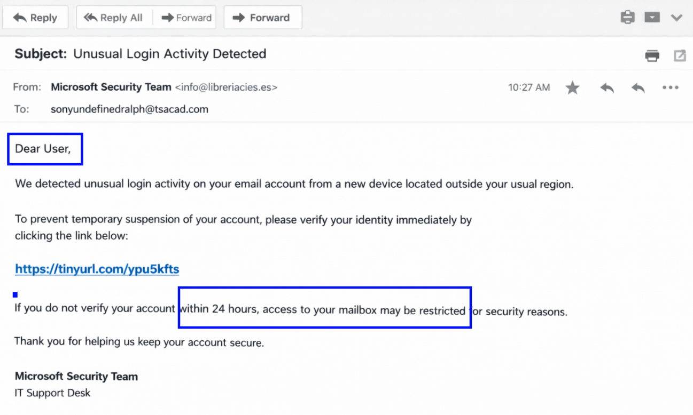
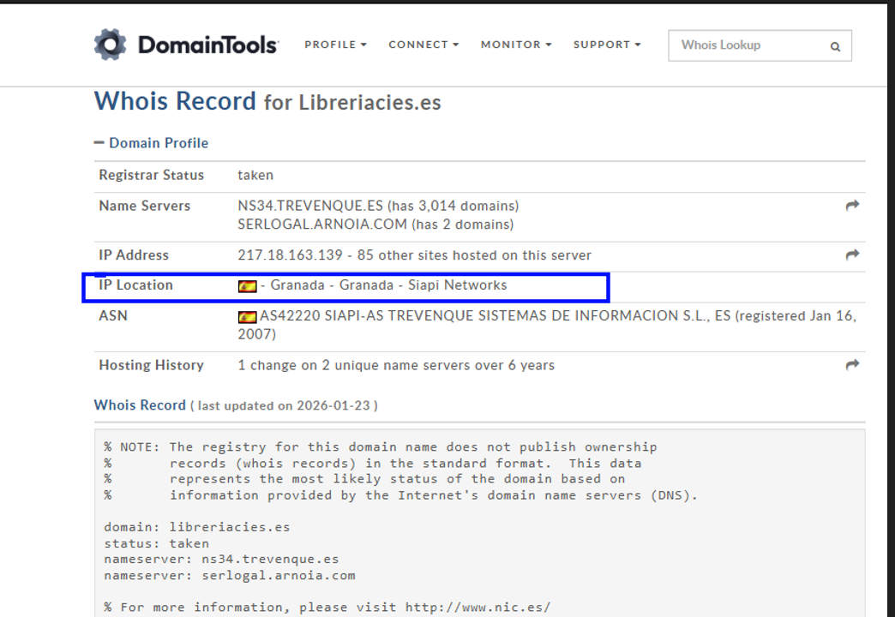
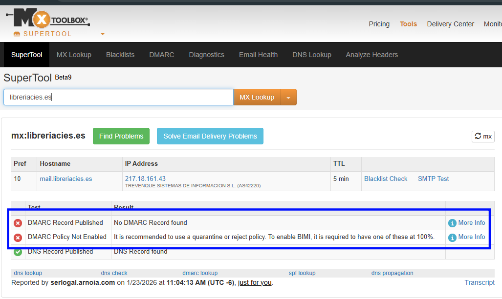
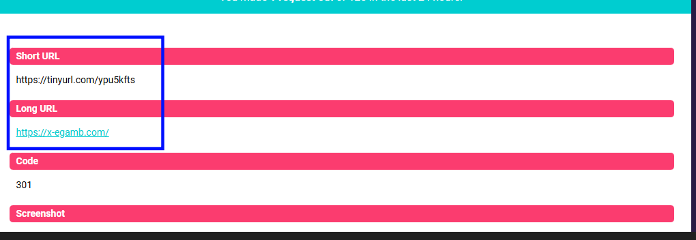
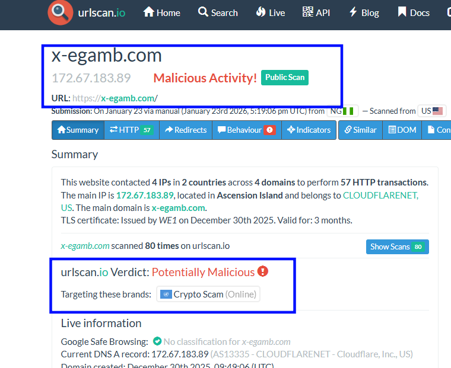
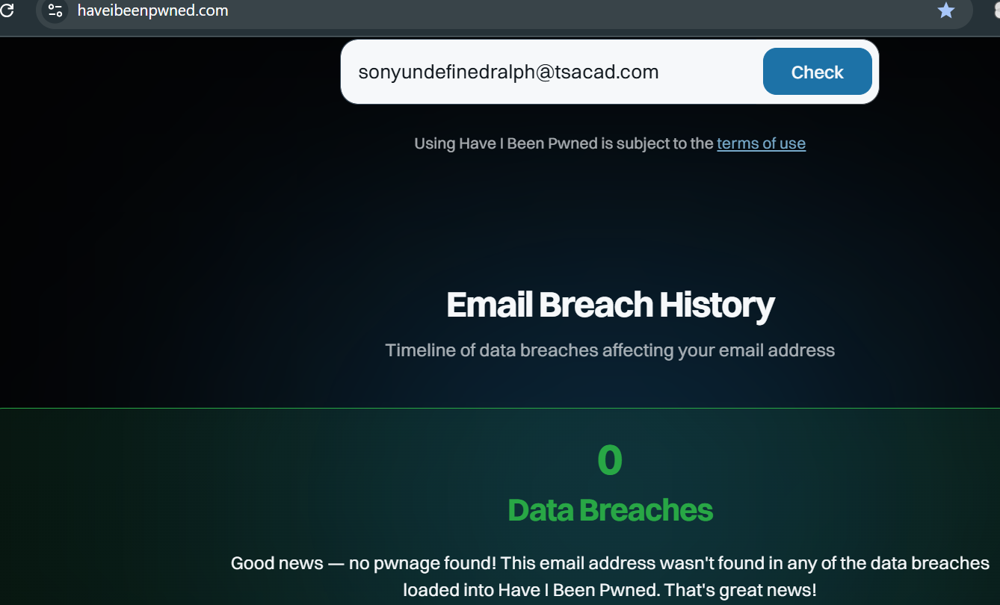

# SOC-Lab-Phishing-Investigation
Technical analysis and incident response report for a credential-harvesting phishing campaign
## 1. Executive Summary
An external phishing campaign was detected targeting sonyundefinedralph@tsacad.com. The attacker impersonated the Microsoft Security Team to induce panic and trick the recipient to click a malicious link. Investigation confirmed that the email originated from a compromised third-party domain in Spain and redirected to a known malicious redirect.  
Status: Resolved  
Severity: High  
Category: Phishing/Credential Harvesting  

## 2. Detection & Analysis
A. Email IOCs  
| Artifacts | Value | Analysis |
| :--- | :--- | :--- |
| **Header: From** | `Microsoft Security Team <info@libreriacies.es>` | The display name is spoofed; the actual sender domain is a Spanish bookstore. |
| **Link** | `https[:]//tinyurl[.]com/ypu5kfts` | Use of a URL shortener to bypass basic link filtering.  

  

B. Behavioral IOCs  
•	Social Engineering: The attacker uses Urgency ("within 24 hours") and Fear ("access... may be restricted") to bypass the user's critical thinking.   
•	Generic Greeting: The use of "Dear User" instead of a specific name indicates mass-mailing.  

  

C. Network IOCs  
•	Whois lookup for libreriacies.es showed the domain is hosted via Siapi Networks in Spain. Since the domain itself belongs to a legitimate bookstore, likely a legitimate account was compromised to send this campaign.  
•	MXToolbox revealed “No DMARC record found” and “DMARC policy not enabled”, allowing unauthorized senders to use the domain with minimal resistance.  
•	Checkshorturl resolved the short URL (https[:]//tinyurl[.]com/ypu5kfts) to x-egamb.com.  
Urlscan.io identified x-egamb.com as a crypto scam landing page.  

  
  
  
  

D. Account exposure  
A search on Have I Been Pwned was conducted for the recipient sonyundefinedralph@tsacad.com  
•	The email has not been involved in any known data breaches; this suggests the user may have been targeted through a mass-mailing list.  

  

## 3. Containment  
•	Blocked the sender's IP address 217.18.161.43 (as shown by mxtoolbox) at the perimeter firewall.  
•	Added the malicious domain x-egamb.com and the TinyURL path to the organization’s DNS sinkhole or web filter.  

## 4. Eradication & Recovery  
•	Deleted all instances of this email from the mail server (Search & Purge) to prevent other users from clicking the link.  
•	Reset credentials for any user who interacted with the link.  
•	Monitor the targeted email account for:  
  o	unusual login patterns  
  o	creation of new inbox rules (often used by attackers to hide further activity).  

## 5. Post-Incident Activity (Lessons Learned)  
Root Cause:  
Exploitation of a poorly configured third-party domain to bypass spam filters.  
Improvement:  
Implement Brand Protection tools to alert if external domains are masquerading as "Microsoft Support".  
User Training:  
Use this specific template for a simulated phishing exercise to train employees on identifying mismatched sender addresses and suspicious links.  

## Final Verdict  
Classification: True Positive  
The incident is confirmed as a Malicious Phishing attempt designed for credential harvesting.  

---

## 📂 Project Files
* **[Full Report (PDF)](./Phishing_Incident_Report.pdf)** - Detailed analysis and remediation steps.
* **[Evidence Screenshots](./Screenshots/)** - Raw captures from MXToolbox, WHOIS, and urlscan.io.

---
