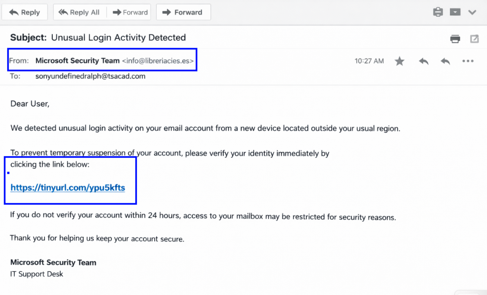

# SOC-Lab-Phishing-Investigation
Technical analysis and incident response report for a credential-harvesting phishing campaign
## 1. Executive Summary
An external phishing campaign was detected targeting sonyundefinedralph@tsacad.com. The attacker impersonated the Microsoft Security Team to induce panic and trick the recipient to click a malicious link. Investigation confirmed that the email originated from a compromised third-party domain in Spain and redirected to a known malicious redirect.
Status: Resolved
Severity: High
Category: Phishing/Credential Harvesting

## 2. Detection & Analysis
A. Email IOCs
| Artifacts | Value | Analysis |
| :--- | :--- | :--- |
| **Header: From** | `Microsoft Security Team <info@libreriacies.es>` | The display name is spoofed; the actual sender domain is a Spanish bookstore. |
| **Link** | `https[:]//tinyurl[.]com/ypu5kfts` | Use of a URL shortener to bypass basic link filtering. |  
  

B. Behavioral IOCs
•	Social Engineering: The attacker uses Urgency ("within 24 hours") and Fear ("access... may be restricted") to bypass the user's critical thinking. 
•	Generic Greeting: The use of "Dear User" instead of a specific name indicates mass-mailing.

